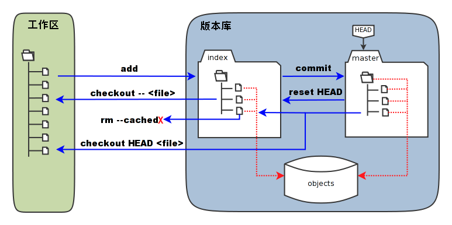

# Git部署



```shell
环境：
    git-server    192.168.246.214  充当中央服务器
    client        192.168.246.213

所有机器关闭防火墙和selinux

安装：所有机器都安装
   [root@git-server ~]# yum install -y git
   [root@git-server ~]# git --version 
   git version 1.8.3.1
   
准备：
    因为Git是分布式版本控制系统，所以，每个机器都必须自报家门：你的名字和Email地址。
    注意git config命令的--global参数，用了这个参数，表示你这台机器上所有的Git仓库都会使用这个配置。

所有的机器都添加，只要邮箱和用户不一样就可以。   
    # git config --global user.email "tian1364548672@gmail.com"     ----设置邮箱
    # git config --global user.name "jack"                   ----加添用户
    # cat /root/.gitconfig
    # git config --global color.ui true		#语法高亮
    # git config --list			#查看全局配置
    user.email=tian1364548672@gmail.com
	user.name=jack
	color.ui=true
```

# git使用

```shell
1、创建一个新目录：在中心服务器上创建
[root@git-server ~]# mkdir /git-test
[root@git-server ~]# useradd git   #创建一个git用户用来运行git
[root@git-server ~]# passwd git  #给用户设置密码
[root@git-server ~]# cd /git-test/
```

```shell
2、通过git init命令把这个目录变成Git可以管理的仓库：
 第1种情况：可以改代码，还能上传到别人的机器，别人也能从你这里下载但是别人不能上传代码到你的机器上。
 第2种情况：只是为了上传代码用，别人从这台机器上下载代码也可以上传代码到这台机器上，经常用于核心代码库。
```

```shell
3、创建裸库：适用于作为远程中心仓库使用
创建裸库才可以从别处push（传）代码过来，使用--bare参数------裸
[root@git-server git-test]# git init --bare testgit
Initialized empty Git repository in /git-test/testgit/
[root@git-server ~]# chown git.git /git-test -R  #修改权限
```

```shell
4、仓库创建完成后查看库目录：
[root@git-server git-test]# cd testgit/
[root@git-server testgit]# ls
branches  config  description  HEAD  hooks  info  objects  refs
```

# 客户端

```shell
1.配置免密登录
[root@client ~]# ssh-keygen    #生成秘钥
[root@client ~]# ssh-copy-id -i git@192.168.246.214   #将秘钥传输到git服务器中的git用户
```

```shell
2.克隆git仓库
[root@client ~]# yum install -y git
[root@client ~]# git clone git@192.168.246.214:/git-test/testgit/
Cloning into 'testgit'...
warning: You appear to have cloned an empty repository.
[root@client ~]# ls  #查看仓库已经克隆下来了
anaconda-ks.cfg    testgit
```

```shell
3、创建文件模拟代码提交到仓库
在testgit目录下创建一个测试文件test.txt
[root@client ~]# cd testgit/
[root@client testgit]# vim test.txt   #随便写点东西


把文件添加到暂存区：使用 "git add" 建立跟踪
[root@client testgit]# git add test.txt
注: 这里可以使用 git add * 或者 git add -A


提交文件到仓库分支：1
[root@client testgit]# git commit -m "test1"
[master (root-commit) 2b51ff9] test1
 1 file changed, 2 insertions(+)
 create mode 100644 test.txt
 -m:描述
 
 
查看git状态：
[root@client testgit]# git status 
# On branch master   #分支位于master


修改文件后再此查看状态：
[root@client testgit]# echo '1122334' >> test.txt
[root@client testgit]# git status
# 位于分支 master
# 尚未暂存以备提交的变更：
#   （使用 "git add <file>..." 更新要提交的内容）
#   （使用 "git checkout -- <file>..." 丢弃工作区的改动）
#
#	修改：      readme.txt
#
修改尚未加入提交（使用 "git add" 和/或 "git commit "


先add
[root@client testgit]# git add -A


再次提交commit：
[root@client testgit]# git commit  -m "add2" test.txt 
[master 73bf688] add2
 1 file changed, 1 insertion(+)
 [root@client testgit]# git status 
# On branch master
nothing to commit, working directory clean
```

# 版本回退

```shell
已经提交了不合适的修改到版本库时，想要撤销本次提交，使用版本回退，不过前提是没有推送到远程库。

查看现在的版本：
[root@client testgit]# git log
显示的哪个版本在第一个就是当前使用的版本。

版本回退(切换)
在Git中，当前版本是HEAD,上一个版本就HEAD^，上上一个版本就是HEAD^^，当然往上100个版本写100个比较容易数不过来，所以写成HEAD~100（一般使用id号来恢复）

回到上一个版本
[root@client testgit]# git reset --hard HEAD^ 
HEAD is now at 0126755 test1

回到指定的版本(根据版本号): 
[root@client testgit]# git reset --hard dd66ff
HEAD is now at dd66ff9 add2
==========================================================
注：消失的ID号：
回到早期的版本后再查看git log会发现最近的版本消失，可以使用reflog查看消失的版本ID，用于回退到消失的版本
[root@vm20 gittest]# git reflog
2a85982 HEAD@{0}: reset: moving to 2a859821a2385e136fe83f3a206b287eb0eb8c18
f5bc8c1 HEAD@{1}: commit: test-version2
2a85982 HEAD@{2}: commit (initial): test-version1

[root@git-client testgit]# git reset --hard f5bc8c1
```

# 删除文件

```shell
从工作区删除test.txt，并且从版本库一起删除
```

```shell
工作区删除：
[root@client testgit]# touch test.txt
[root@client testgit]# git status
# On branch master
# Untracked files:
#   (use "git add <file>..." to include in what will be committed)
#
#       qf.txt
nothing added to commit but untracked files present (use "git add" to track)
[root@client testgit]# rm -rf test.txt  未添加到暂存区，可直接删除
[root@client testgit]# git status
# On branch master
nothing to commit, working directory clean

```

```shell
已从工作区提交到暂存区：
第一种方法
[root@client testgit]# touch test.txt
[root@client testgit]# git status
# On branch master
#
# Initial commit
#
# Untracked files:
#   (use "git add <file>..." to include in what will be committed)
#
#       test.txt
nothing added to commit but untracked files present (use "git add" to track)

[root@client testgit]# git add test.txt
[root@client testgit]# git status
# On branch master
#
# Initial commit
#
# Changes to be committed:
#   (use "git rm --cached <file>..." to unstage)
#
#       new file:   test.txt
#

[root@client testgit]#  git rm --cache test.txt #从暂存区移除
rm 'test.txt'
[root@client testgit]# ls
test.txt
[root@client testgit]# git status
# On branch master
#
# Initial commit
#
# Untracked files:
#   (use "git add <file>..." to include in what will be committed)
#
#       test.txt
nothing added to commit but untracked files present (use "git add" to track)
[root@client testgit]# rm -rf test.txt 
[root@client testgit]# git status
# On branch master
#
# Initial commit
#
nothing to commit (create/copy files and use "git add" to track)

第二种方法：
[root@client testgit]# touch  b.txt
[root@client testgit]# git add b.txt 
[root@client testgit]# git status
# On branch master
#
# Initial commit
#
# Changes to be committed:
#   (use "git rm --cached <file>..." to unstage)
#
#       new file:   b.txt
#
[root@client testgit]# git rm -f b.txt  ##这种删除连同工作区一块儿删除
rm 'b.txt'
[root@client testgit]# ls
[root@client testgit]# git status    
# On branch master
#
# Initial commit
#
nothing to commit (create/copy files and use "git add" to track)
```

```shell
直接在暂存区rm掉文件，如何解决
[root@client testgit]# touch c.txt
[root@client testgit]# git add c.txt 
[root@client testgit]# ls
c.txt
[root@client testgit]# git status
# On branch master
#
# Initial commit
#
# Changes to be committed:
#   (use "git rm --cached <file>..." to unstage)
#
#       new file:   c.txt
#
[root@client testgit]# rm -rf c.txt 
[root@client testgit]# git status
# On branch master
#
# Initial commit
#
# Changes to be committed:
#   (use "git rm --cached <file>..." to unstage)
#
#       new file:   c.txt
#
# Changes not staged for commit:
#   (use "git add/rm <file>..." to update what will be committed)
#   (use "git checkout -- <file>..." to discard changes in working directory)
#
#       deleted:    c.txt
#
[root@client testgit]# git rm --cache c.txt
rm 'c.txt'
[root@client testgit]# ls
[root@client testgit]# git status
# On branch master
#
# Initial commit
#
nothing to commit (create/copy files and use "git add" to track)
[root@client testgit]# 
```

# 修改文件

```shell
暂存区修改名称
[root@client testgit]# touch  a.txt
[root@client testgit]# git status
# On branch master
# Untracked files:
#   (use "git add <file>..." to include in what will be committed)
#
#       a.txt
nothing added to commit but untracked files present (use "git add" to track)
[root@client testgit]# git add a.txt 
[root@client testgit]# git status
# On branch master
# Changes to be committed:
#   (use "git reset HEAD <file>..." to unstage)
#
#       new file:   a.txt
#
[root@client testgit]# git mv a.txt  d.txt
[root@client testgit]# git status
# On branch master
# Changes to be committed:
#   (use "git reset HEAD <file>..." to unstage)
#
#       new file:   d.txt
#
[root@client testgit]# ls
d.txt  test.txt
[root@client testgit]# git rm --cache d.txt
[root@client testgit]# rm -rf d.txt
```

# 将代码上传到仓库的master分支

```shell
[root@client testgit]# vi a.txt   #创建一个新文件
hello world
[root@client testgit]# git add a.txt 
[root@client testgit]# git commit -m "add"
[root@client testgit]# git push origin master   #上传到中心仓库master分支
Counting objects: 11, done.
Compressing objects: 100% (4/4), done.
Writing objects: 100% (11/11), 828 bytes | 0 bytes/s, done.
Total 11 (delta 0), reused 0 (delta 0)
To git@192.168.246.214:/git-test/testgit/
 * [new branch]      master -> master
```

```shell
在客户端将仓库删除掉然后在克隆下来查看仓库中是否有文件
[root@client testgit]# cd
[root@client ~]# rm -rf testgit/
[root@client ~]# git clone git@192.168.246.214:/git-test/testgit/
Cloning into 'testgit'...
remote: Counting objects: 11, done.
remote: Compressing objects: 100% (4/4), done.
remote: Total 11 (delta 0), reused 0 (delta 0)
Receiving objects: 100% (11/11), done.
[root@client ~]# cd testgit/
[root@client testgit]# ls
a.txt
[root@client testgit]# cat a.txt 
hello world
```

# 创建分支并合并分支

```shell
每次提交，Git都把它们串成一条时间线，这条时间线就是一个分支。截止到目前，只有一条时间线，在Git里，这个分支叫主分支，即`master`分支。`HEAD`严格来说不是指向提交，而是指向`master`，`master`才是指向提交的，所以，`HEAD`指向的就是当前分支。
```

```shell
客户端操作
[root@client ~]# git clone git@192.168.246.214:/git-test/testgit/
[root@client testgit]# git status 
# On branch master   #当前所在为master分支
#
# Initial commit
#
nothing to commit (create/copy files and use "git add" to track)
注意：刚创建的git仓库默认的master分支要在第一次commit之后才会真正建立。然后先git add .添加所有项目文件到本地仓库缓存，再git commit -m "init commit"提交到本地仓库，之后就可以随心所欲地创建或切换分支了。
创建分支:
[root@client testgit]# git branch dev   #创建分支。
[root@client testgit]# git branch    #查看分支。*在哪里就表示当前是哪个分支
  dev
* master
切换分支:
[root@client testgit]# git checkout dev
Switched to branch 'dev'
[root@client testgit]# git branch 
* dev
  master
在dev分支创建一个文件；
[root@client testgit]# vi test.txt
[root@client testgit]# git add test.txt 
[root@client testgit]# git commit -m "add dev"
[dev f855bdf] add dev
 1 file changed, 1 insertion(+)
 create mode 100644 test.txt
现在，dev分支的工作完成，我们就可以切换回master分支：
 [root@client testgit]# git checkout master
Switched to branch 'master'
```

```shell
切换回`master`分支后，再查看一个`test.txt`文件，刚才添加的内容不见了！因为那个提交是在`dev`分支上，而`master`分支此刻的提交点并没有变：
```

```shell
[root@client testgit]# ls
a.txt
```

```shell
现在，我们把`dev`分支的工作成果合并到`master`分支上：
```

```shell
[root@client testgit]# git merge dev
Updating 40833e0..f855bdf
Fast-forward
 test.txt | 1 +
 1 file changed, 1 insertion(+)
 create mode 100644 test.txt
[root@client testgit]# ls
a.txt  test.txt
现在已经将dev分支的内容合并到master上。确认没有问题上传到远程仓库:
[root@client testgit]# git push origin master
```

```shell
`git merge`命令用于合并指定分支到当前分支。合并后，再查看`test.txt`的内容，就可以看到，和`dev`分支的最新提交是完全一样的。
```

```shell
合并完成后，就可以放心地删除`dev`分支了：
```

```shell
[root@client testgit]# git branch -d dev
Deleted branch dev (was f855bdf).
```

```shell
删除后，查看`branch`，就只剩下`master`分支了：
[root@client testgit]# git branch 
* master
```

